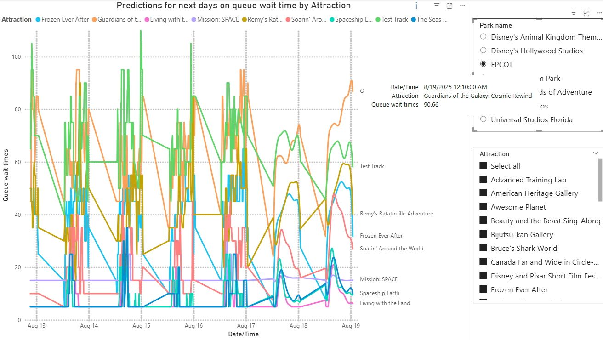

# TPW - Theme Park Wizard 🧙‍♂️🐭🪄
Theme Park Wizard is here to help you on your journey!

## Project Overview
TPW is a data-driven solution that transforms how you plan your theme park visits. In a world where a lack of planning often leads to frustrating experiences and wasted money, this project leverages the power of Big Data to provide valuable insights, ensuring you make the most of your time and money (invested)😉.

Main goal here is to help visitors make informed decisions by providing insights that guarantee a better use of their time inside the park. Say goodbye to improvising and waiting in long lines!

## Key Features and Metrics
TPW offers 4 main metrics, designed to provide comprehensive and robust planning:

- Historical Average Wait Time: Tracks the average wait time for each attraction daily, helping you identify the best times to visit certain attractions.

- Operational Percentage: Reveals the probability of an attraction being open based on its historical status ("Operational", "Down" or "Under Maintanence"), helping you avoid frustration with out-of-service rides.

- Wait Time Prediction: A predictive model that estimates wait times in 10-minute intervals for your planned visit day, allowing you to prepare your itinerary based on data.

- Optimized Route: The core feature that generates a personalized and optimized itinerary for your day, based on a genetic algorithm, it uses an heuristically function to reach an optimal order and time to visit attractions, aiming to maximize the number of rides and shows you can experience.

